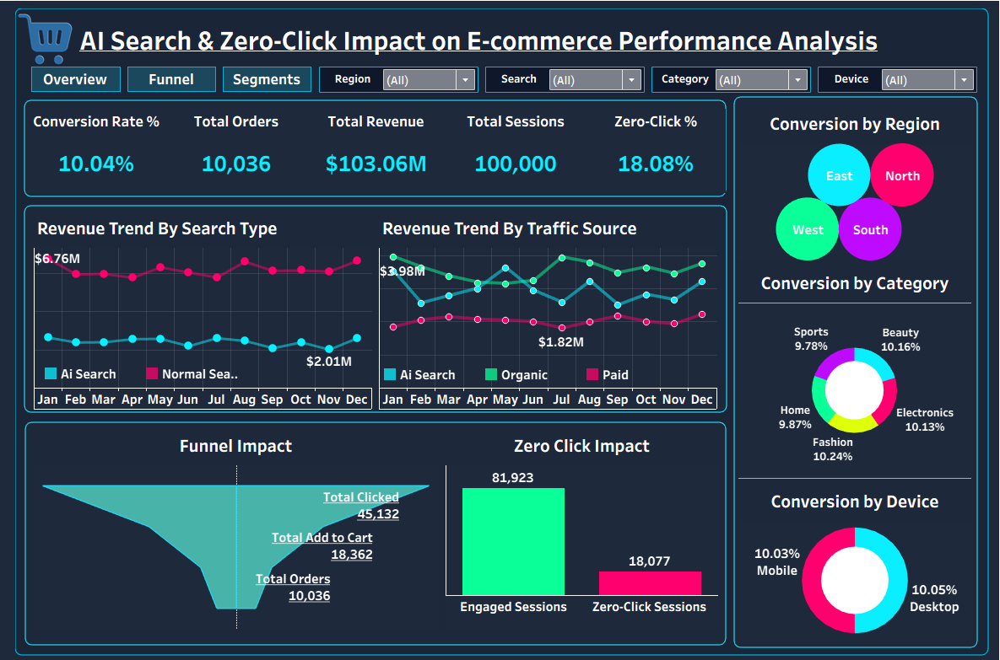

# AI Search & Zero-Click Impact on E-commerce Performance

An end-to-end data analytics project analyzing how AI-powered search and zero-click experiences influence conversion, revenue, and funnel performance in an e-commerce business.

---

## Why I Built This Project

I built this project to evaluate the **real business impact of AI Search and Zero-Click behavior** in e-commerce.

AI search and zero-click experiences are becoming common, but their effect on **revenue and funnel depth** is often unclear. This project focuses on answering practical business questions such as:
- Does AI Search actually improve revenue?
- How much value is lost due to Zero-Click behavior?
- Where exactly does the funnel break?
- Which segments perform better and why?

I approached this as a **business problem first**, and then used data to support decisions.

---

## Business Context

Modern e-commerce platforms increasingly use:
- AI-powered search
- AI-generated summaries
- Zero-click answers

While these features improve information access, they can also:
- Reduce product discovery
- Shorten the customer journey
- Create hidden revenue leakage

The business needs to understand whether AI Search is a **growth driver** or whether Zero-Click behavior is **hurting monetization**.

---

## Problem Statement

Analyze session-level e-commerce data to evaluate the impact of AI Search and Zero-Click experiences on conversion rate, revenue, and funnel performance, and identify opportunities to improve business outcomes without increasing traffic acquisition spend.

---

## Tableau Dashboard

The final Tableau dashboard provides an executive-level view of the impact of **AI Search and Zero-Click behavior** on e-commerce performance.  
It highlights key KPIs, funnel drop-offs, revenue trends, and segment-level insights.

---

## Tools I Used

- **SQL**
  - Funnel analysis
  - Conversion and revenue metrics
  - Segment-level analysis

- **Python (Jupyter Notebooks)**
  - Data exploration and validation
  - KPI verification
  - Trend analysis

- **Tableau**
  - Interactive dashboard
  - Executive-level storytelling

---

## Dataset Overview

The dataset is session-level e-commerce data, where:
- Each row represents one user session
- Sessions include search type, funnel progression, and revenue outcome

Key dimensions include:
- Search type (AI Search, Classic Search, Zero-Click)
- Device, category, and region
- Funnel stages (click, add to cart, purchase)
- Revenue metrics

---

## How I Approached the Analysis
Raw Data
↓
Data Cleaning & Validation (Python)
↓
Load into PostgreSQL
↓
SQL Analysis (Funnel, Conversion, Revenue)
↓
Python Validation & EDA
↓
Tableau Dashboard (KPIs & Insights)
↓
Business Insights & Recommendations

---

## Analysis Breakdown

### SQL Analysis
I used SQL to:
- Measure conversion rate by search type
- Identify funnel drop-offs (Click → Add-to-Cart → Purchase)
- Compare AI Search, Classic Search, and Zero-Click performance
- Analyze performance by device, category, and region

### Python Analysis
I used Python to:
- Validate KPIs calculated in SQL
- Explore trends and distributions
- Cross-check findings before visualization

### Tableau Dashboard
I built a Tableau dashboard to:
- Track core KPIs
- Visualize funnel impact
- Compare AI Search vs Zero-Click behavior
- Present insights in a format suitable for business stakeholders

---

## Key KPIs

| KPI | Description |
|-----|-------------|
| Sessions | Total user sessions |
| Orders | Completed purchases |
| Conversion Rate | Orders / Sessions |
| Revenue | Total sales value |
| Add-to-Cart Rate | Add to Cart / Sessions |
| Zero-Click % | Zero-Click Sessions / Total Sessions |

---

## Key Insights

- Overall conversion rate is healthy at **~10%**, indicating strong intent
- **18% of sessions are Zero-Click**, meaning users do not enter the shopping funnel
- The biggest revenue leakage occurs between **Click and Add-to-Cart**
- **AI Search generates higher and more consistent revenue** than Classic Search
- Zero-Click behavior limits product discovery and monetization
- Mobile and Desktop conversion rates are similar, but mobile drives higher volume
- Category and regional performance varies, indicating personalization opportunities

---

## Business Impact

- Improving the Click → Add-to-Cart stage can unlock significant revenue
- Reducing Zero-Click dead ends increases funnel depth
- AI Search is a revenue driver when it pushes users toward exploration
- Revenue growth is possible **without increasing traffic spend**

---

## Recommendations

**Short-Term**
- Improve product page clarity and trust signals
- Reduce friction in add-to-cart and checkout
- Add clearer calls-to-action in AI and Zero-Click experiences

**Long-Term**
- Redesign Zero-Click experiences to encourage exploration
- Optimize AI Search behavior by category
- Personalize experiences by region and device
- Continuously test search and funnel designs

---

## Final Takeaway

AI Search improves revenue when it guides users into the shopping funnel. However, excessive Zero-Click behavior and drop-offs at the Add-to-Cart stage create measurable revenue leakage. Focusing on funnel efficiency and AI-guided discovery can drive sustainable growth without increasing acquisition costs.

---

## Author

Priyanka Lakra  
Data Analyst | Business-Focused Analytics  

